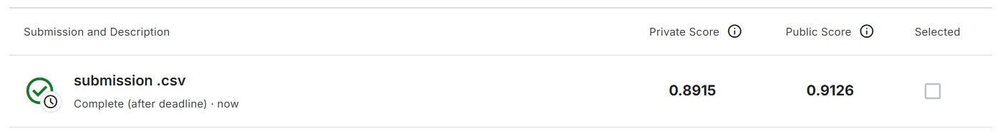

# Histopathologic Cancer Detection (Kaggle)

A deep learning project for detecting metastatic cancer in histopathologic scans of lymph node sections using transfer learning and fine-tuning techniques.

## 📋 Project Overview

This project addresses the **Histopathologic Cancer Detection** challenge from Kaggle, which is a binary image classification task in medical imaging. The goal is to build a model that can accurately identify metastatic tissue in small image patches extracted from larger digital pathology scans.

### Competition Details

- **Task Type:** Binary Classification
- **Dataset:** Modified version of the PatchCamelyon (PCam) benchmark dataset
- **Image Size:** 96×96 pixel RGB patches
- **Evaluation Metric:** Area Under the ROC Curve (AUC)
- **Classes:** 
  - Label 0: No metastatic tissue
  - Label 1: Contains metastatic tissue

## 🎯 Objective

Build a deep learning model that accurately identifies metastatic cancer tissue in 96×96px histopathologic image patches to assist in cancer diagnosis.


## 📁 Project Structure

```
Histopathologic-Cancer-Detection-Kaggle/
├── histopathologic_cancer_detection.ipynb  # Main notebook
├── kaggle.json                             # Kaggle API credentials
├── README.md                               # Project documentation
├── data/                                   # Dataset directory
│   ├── train_labels.csv                    # Training labels
│   ├── train/                              # Training images (TIF format)
│   ├── train_png/                          # Converted PNG images
│   ├── test/                               # Test images
│   └── sample_submission.csv               # Submission template
└── weights/                                # Model weights (auto-generated)
```

## 📊 Workflow

1. **Setup & Configuration**
   - Environment detection (Colab vs Local)
   - Library imports and seed configuration

2. **Data Preparation**
   - Automatic data download (Colab) or local path setup
   - TIF to PNG conversion with parallel processing
   - DataFrame generation with file paths

3. **Exploratory Data Analysis (EDA)**
   - Class distribution analysis
   - Sample visualization
   - Variance-based data cleaning

4. **Model Building**
   - Train/validation split (80/20)
   - TensorFlow dataset pipeline creation
   - Data augmentation model
   - Transfer learning with multiple base models

5. **Training & Evaluation**
   - Model comparison across architectures
   - Best model selection based on validation AUC

6. **Fine-Tuning**
   - Unfreezing top layers of the best model
   - Low learning rate training
   - Performance visualization

## 🔧 Setup Instructions

### For Google Colab

1. Open the notebook in Google Colab
2. Run all cells - data will be automatically downloaded from Google Drive
3. The notebook will handle all dependencies and setup

### For Local Development

1. Clone this repository:
   ```bash
   git clone https://github.com/RockDeng110/Histopathologic-Cancer-Detection-Kaggle.git
   cd Histopathologic-Cancer-Detection-Kaggle
   ```

2. Download the dataset and extract it to the `data/` directory:
   ```
   data/
   ├── train_labels.csv
   ├── train/
   └── test/
   ```

3. Install dependencies:
   ```bash
   pip install tensorflow keras pandas numpy opencv-python pillow joblib tqdm seaborn matplotlib scikit-learn
   ```

4. Run the Jupyter notebook:
   ```bash
   jupyter notebook histopathologic_cancer_detection.ipynb
   ```

## 📈 Results

The project implements a comprehensive model comparison framework that:
- Evaluates multiple state-of-the-art architectures
- Uses early stopping and learning rate scheduling
- Applies fine-tuning for optimal performance
- Tracks AUC, accuracy, and loss metrics across training phases
- Score from kaggle


## 🤖 AI Tools Declaration

This project was developed with assistance from AI tools including GitHub Copilot and Google Gemini Pro for code optimization, debugging, and documentation.

## 📝 License

This project is for educational purposes as part of the Kaggle competition.

## 🔗 Links

- [Kaggle Competition](https://www.kaggle.com/c/histopathologic-cancer-detection)
- [PatchCamelyon Dataset](https://github.com/basveeling/pcam)

---

**Note:** This is an educational project demonstrating deep learning techniques for medical image classification.
